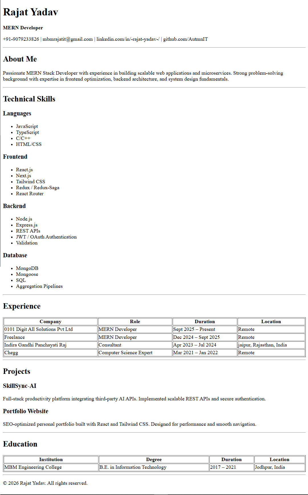

# Rajat Yadav - Resume Website

## Overview
This is a single-page resume website built using pure HTML.
The project focuses on semantic HTML structure without using CSS.

## Features
- Header with contact details
- About section
- Skills list
- Experience table
- Projects section
- Education table
- Footer

## Setup Instructions
1. Clone the repository
2. Open index.html in any browser

## Usage
This website represents my professional resume in web format.
It can be hosted using GitHub Pages or Netlify.

## Screenshots

